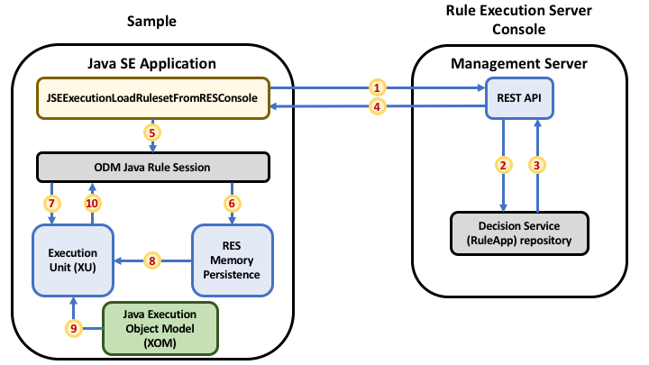

# Execute an IBM ODM Decision Service downloaded from a remote Rule Execution Server Console 


[](https://travis-ci.org/ODMDev/decisions-ruleapp-rest-loader)
[](https://opensource.org/licenses/Apache-2.0)
<p align="center">
  <a href="https://join.slack.com/t/odmdev/shared_invite/enQtMjU0NzIwMjM1MTg0LTQyYTMzNGQ4NzJkMDYxMDU5MDRmYTM4MjcxN2RiMzNmZWZmY2UzYzRhMjk0N2FmZjU2YzJlMTRmN2FhZDY4NmQ">
        Follow us on slack
        <br>
        
  </a>
</p>

This Java SE sample illustrates how to execute a decision service _downloaded from the ODM Rule Execution Server Console_ in Java SE with IBM Operational Decision Manager. 

It makes use of:
 * ODM [RES Console Management REST API](https://www.ibm.com/support/knowledgecenter/en/SSQP76_8.9.2/com.ibm.odm.dserver.rules.res.managing/topics/con_res_restapi_rsrcmng_intro.html)
 * ODM [Rule sessions JSE API](https://www.ibm.com/support/knowledgecenter/en/SSQP76_8.9.2/com.ibm.odm.dserver.rules.res.developing/topics/con_res_devclient_rule_sessions.html)
 * The [Java SE memory persistence](https://www.ibm.com/support/knowledgecenter/en/SSQP76_8.9.2/com.ibm.odm.dserver.rules.res.managing/topics/con_res_mem_persistence.html) introduced in *ODM 8.9.2*.

The sample architecture and workflow are as follows:



 1. The ODM RES Console Management REST API is invoked from the application's code to retrieve a RuleApp containing the ruleset to execute from the remote RES Console.
 1. On the RES Console side, the REST API asked the RuleApp management service for the target ruleset. 
 1. A RuleApp containing the ruleset to execute is retrieved from the RES Console's RuleApp repository
 1. The REST API returns this RuleApp and makes it available to the application. 
 1. The Java Rule session API is used to manage RuleApps and execute rulesets within the scope of the JSE application.  
 1. The RuleApp downloaded in step 4. is added to the RES memory persistence. 
 1. The Rule Session API delegates the ruleset execution to the RES Execution Unit (XU).
 1. The XU fetches the ruleset from the RES memory persistence .
 1. The XU retrieves the Java Execution Object Model (XOM) from the application classloader.
 1. The XU finally executes the ruleset and passes the available output results to the Rule Session API.
 
## Pre-requisites

First, you'll need [IBM Operational Decision Manager, version **8.9.2**](https://www.ibm.com/support/knowledgecenter/en/SSQP76_8.9.2/com.ibm.odm.distrib/kc_welcome_odm_distrib.html) or higher.

Finally, as the executed ruleset is downloaded from the RES console web application, you'll have to:
 1. Deploy the RuleApp containing the ruleset to an existing RES console.
 1. Provide the RES Console URL and its credentials so that the RES Console Management REST API can be appropriately invoked.

### Defining the ODM 8.9.2 installation directory  

To build and run this sample you'll need to set the `ibm.odm.install.dir` maven property so that it points to the actual location where ODM 8.9.2 is installed.

### Deploying the RuleApp

The ruleset run by this sample is provided in the `ruleapp/my-decision-service-1.0.jar` RuleApp archive. 
Deploy this RuleApp archive to your target RES Console with your preferred deployment option, for instance:
 * By logging into the RES Console web application from a browser and then adding the RuleApp.
 * By invoking the RES Console Management REST API with cURL from the command line: 
 ```
 curl -v -X POST -H "Content-Type: application/octet-stream" --data-binary @./ruleapp/my-decision-service-1.0.jar -u <userName>:<password> <url>/apiauth/v1/ruleapps 
 ```
 Where:
   * `url` is the RES Console URL. For instance, `http://localhost:9080/res`
   * `userName` and ` password` are the credentials used to deploy the RuleApp with the RES Console Management REST API. For instance, respectively `resAdmin` and `resAdmin`.

### Providing the RES Console URL and credentials

The RES Console URL and credentials should be made available in the `RESConsole.json` JSON file located at the root of the project's directory. Its expected structure is as follows:   
```
{
	"url" : "<RES Console URL>",
	"userName" : "<user name>",
	"password" : "<password>"
}
```

## Building
To build the source code, type the maven command:
```
mvn clean install -Dibm.odm.install.dir="<ODM_INSTALL_DIR>"
```

## Running
 1. Make sure you have filled-in the RES Console URL and credentials in the `RESConsole.json` JSON file located at the root of the project's directory. 
 1. Type the following maven command:
```
mvn exec:java -Dexec.mainClass="j2serulesession.RESConsoleSample" -Dexec.args="/test_deployment/loan_validation_with_score_and_grade" -Dexec.classpathScope="test" -Dibm.odm.install.dir="<ODM_INSTALL_DIR>"
```

## License
[Apache 2.0](LICENSE)

## Notice
© Copyright IBM Corporation 2018.

[](https://travis-ci.org/ODMDev/decisions-ruleapp-rest-loader)
[](https://opensource.org/licenses/Apache-2.0)
